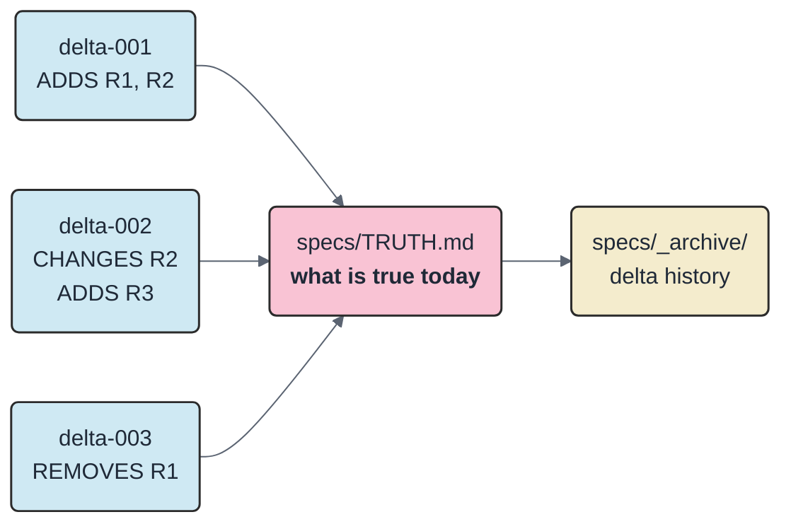
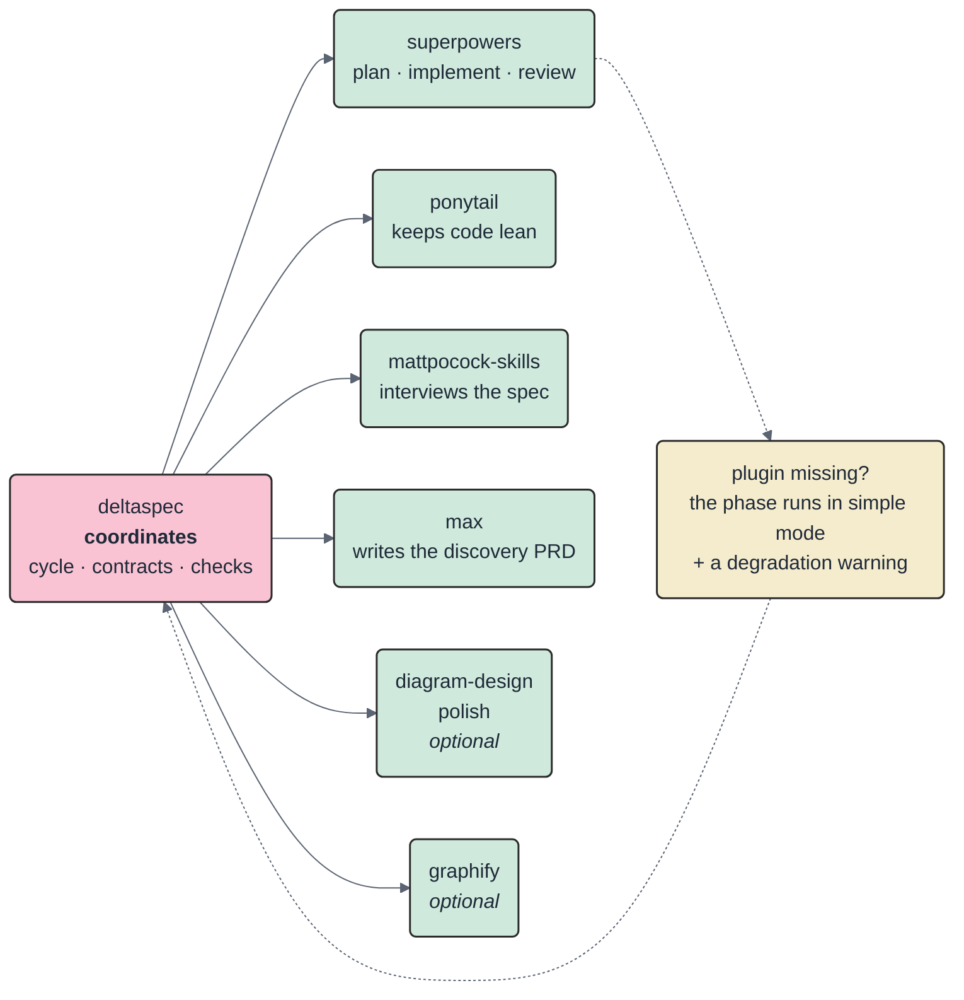
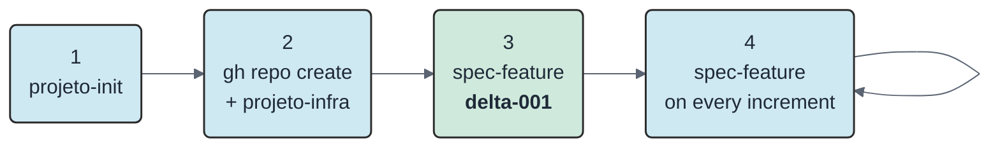
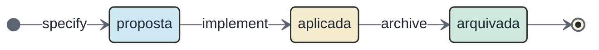
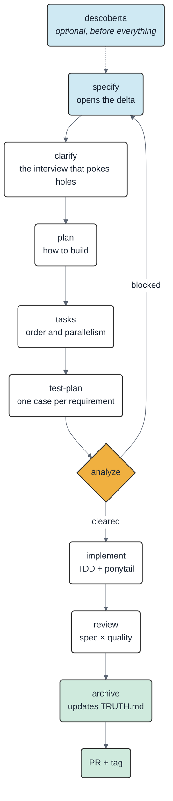
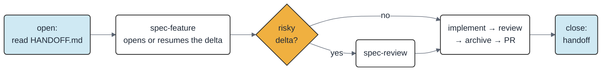
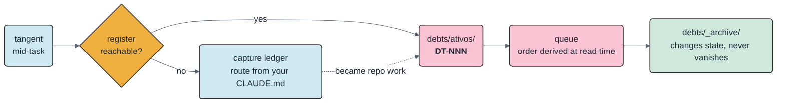

<!-- Espelho sancionado do README.md (DT-015): tradução integral — mudou lá, sincronize aqui no mesmo change. -->
# deltaspec

**Spec-Driven Development via delta specs**, for [Claude Code](https://claude.com/claude-code).

**[Leia em português](README.md)** · Project language is PT-BR — this English README and the summary in [CONTRIBUTING.md](CONTRIBUTING.md) are the sanctioned exceptions.

Instead of maintaining a giant requirements document that ages badly, each feature writes **only what changes**. A single file — `specs/TRUTH.md` — holds what is true today.

> **It's git, applied to requirements.** Each feature is a spec *commit* (ADICIONA / MUDA / REMOVE — adds / changes / removes). `TRUTH.md` is the *working tree*: the current state, with every commit already applied. Old specs go to `specs/_archive/` — they are history, not truth.

[Current version: tags](https://github.com/iuripereira/deltaspec/tags) · 18 skills · MIT License

---

## Table of contents

1. [The problem](#1-the-problem)
2. [Installation](#2-installation)
3. [Start a project](#3-start-a-project)
4. [The lifecycle of a feature](#4-the-lifecycle-of-a-feature)
5. [Day to day](#5-day-to-day)
6. [The debt register](#6-the-debt-register)
7. [The skills](#7-the-skills)
8. [The automated checks](#8-the-automated-checks)
9. [Where everything lives](#9-where-everything-lives)

---

## 1. The problem

You write a 40-page PRD, ship 3 features — and the PRD is already lying. Nobody rewrites the whole document on every change, so it becomes fiction.

deltaspec's way out: **the big document is never written by hand.** It is assembled from the deltas.



What this gives you:

| You get | How |
|---|---|
| A spec that doesn't lie | `TRUTH.md` only changes at archive time, and only with what the delta declared |
| Cheap context for the AI | The AI reads only the relevant TRUTH partition — short by rule (`RNF1`) — instead of a whole PRD |
| Traceability | Every requirement has a fixed ID (`R7`, `RNF2`) and shows which delta it came from: `R7 (delta-006)` |
| Requirements can't vanish by accident | A script compares `TRUTH.md` before and after: if something disappeared without a declared `REMOVE`, the PR is blocked |

---

## 2. Installation

### 2.1 The plugin — 2 commands inside Claude Code

```
/plugin marketplace add iuripereira/deltaspec
/plugin install deltaspec@deltaspec
```

Done: the 18 skills show up under the `deltaspec:` prefix. To update later, `/plugin update deltaspec@deltaspec` — without the marketplace's `@deltaspec`, the plugin is not found.

### 2.2 The engines — clone + 1 command

deltaspec **coordinates**; third-party plugins **do** the heavy lifting of each phase. Clone the repository and run the installer — so you can read the script before executing it:

```bash
git clone https://github.com/iuripereira/deltaspec
bash deltaspec/scripts/instala-motores.sh
```

### 2.3 The gates — 1 dependency

```bash
pip install pyyaml
```

The framework's single external dependency, used to validate `doc-profile.yaml` ([ADR-0023](docs/adrs/ADR-0023-pyyaml-como-dependencia-admitida.md)). Without it the gates stop with a message asking for this command; everything else is the Python 3.11+ standard library.



Each one covers a front: [`superpowers`](https://github.com/anthropics/claude-plugins) runs plan, implement and review; `ponytail` holds back over-engineering; `mattpocock-skills` interviews the spec (`grilling`) and models the domain (`domain-modeling`); `max` writes the discovery PRD (`write-prd`); [`diagram-design`](https://github.com/cathrynlavery/diagram-design) is **optional** and only kicks in when a project declares it — polish for client/management docs comes from a native engine, with no third-party plugin on the default path ([ADR-0029](docs/adrs/ADR-0029-apresentacao-como-modo-e-html-autocontido-canonico.md)); `graphify`, also optional, provides a code graph as a citable source (`file:line`).

> **Golden rule:** a missing plugin **never breaks the cycle**. The phase falls back to the simple path described in [`adapters.md`](skills/spec-feature/references/adapters.md) and you get a warning telling you which phase lost power.

### 2.4 Mermaid — the only required CLI

```bash
npm install -g @mermaid-js/mermaid-cli
```

Other renderers (DBML, PlantUML, D2, Structurizr) and the PDF/DOCX exporter only come in if the project's `doc-profile.yaml` asks for them — the [`doc-entregavel`](skills/doc-entregavel/SKILL.md) skill lists the commands at the right time.

---

## 3. Start a project



**1. Prepare the folder.**

```
/deltaspec:projeto-init
```

It figures out the project type, writes the `CLAUDE.md` from the canonical rules, creates the base files and checks that the engines are installed. **It never overwrites anything:** if a `CLAUDE.md` already exists, you get a `CLAUDE.generated.md` next to it, with the diff, and you decide what to merge.

**2. Protect the repository** (after creating the remote on GitHub):

```
/deltaspec:projeto-infra
```

Branch protection, CI, Conventional Commits check, release-please, assisted review. Running it again breaks nothing — the second run just reports what was already there.

Also enable the pre-commit gate, once per clone:

```bash
git config core.hooksPath .githooks
```

**3. Write the first feature.**

```
/deltaspec:spec-feature
```

**delta-001 is always the walking skeleton**: the smallest slice that works end to end. Never "the whole system" — the big vision becomes the "Não implementado" (not implemented) section of `TRUTH.md`.

**4. Repeat on every increment.** `TRUTH.md` grows on its own, one archive at a time.

> **Existing project?** Nothing is overwritten or migrated without you asking. Missing files are created, `.gitignore` only receives new lines, `TRUTH.md` is born empty and grows with the **new** deltas, and numbering continues from the highest number already used.

---

## 4. The lifecycle of a feature

One feature = one `specs/NNN-nome/` folder with `spec.md`, `plan.md` and `tasks.md`. It goes through three states:



- **proposta** (proposed) — the spec exists, the code doesn't.
- **aplicada** (applied) — the code exists, but the requirement hasn't reached `TRUTH.md` yet.
- **arquivada** (archived) — the folder moves to `specs/_archive/NNN-nome/` **and** `TRUTH.md` is updated.

> **Archiving is part of "done".** A feature without its archive is an unfinished feature. The version tag is cut on the merge that closes the delta.

The `NNN` number **never resets**: it is cited in ADRs, commits and in `TRUTH.md` itself.

### The phases



| Phase | The question it answers | What comes out |
|---|---|---|
| **descoberta** (discovery) | "What exists today, really?" | dossier of the current process, with a confidence level on every claim |
| **specify** | "What changes in what is already true?" | `spec.md` with ADICIONA/MUDA/REMOVE blocks |
| **clarify** | "Where is this spec fragile?" | spec revised after the interview |
| **plan** | "How do we build it?" | `plan.md` |
| **tasks** | "In what order? What can run in parallel?" | `tasks.md` with `(dep: T1, T2)` dependencies — and, when `doc-profile.yaml` enables `motores.jira`, the `tickets.md` projected to Jira (epic + tickets + blocking links) |
| **test-plan** | "How do I prove each requirement works?" | `test-plan.md` with `cobre: Rn` (covers) |
| **analyze** | "Do the documents agree with each other?" | `analyze.md` with a LIBERADO (cleared) or BLOQUEADO (blocked) verdict |
| **implement** | — | code + tests |
| **review** | "Does the code do what the spec promised? Any fat left?" | findings from both axes |
| **archive** | "What becomes true?" | updated `TRUTH.md` + delta moved |

### Not every feature needs the full cycle

At specify time the AI **suggests** a profile, with a one-line justification. It **only takes effect if you approve it**, and the approval is recorded in the spec header.

| Stage | `completo` (full) | `enxuto` (lean) |
|---|---|---|
| clarify | always | only if ambiguity shows up |
| test-plan | required | waivable, with a written reason |
| review | two axes in parallel | both axes together, in one pass |
| plan · tasks · analyze · archive | in full | in full |

Bug fixes have their own path (`Tipo: bugfix`): a template with symptom, reproduction, root cause and regression test, and a short pipeline — specify → plan → implement → review. If the bug doesn't change a requirement, it archives **without** touching `TRUTH.md`.

---

## 5. Day to day



Two hygiene rules hold up the rest:

- **1 session = 1 branch = 1 scope.** Work from another topic showed up? It becomes another branch — or a `DT-NNN` file in `debts/ativos/`.
- **Close with `/deltaspec:handoff`.** What you learned goes into the project files, not into the conversation's memory.

---

## 6. The debt register

What you notice in the middle of a task must not depend on your memory. **Every tangent becomes a file with a stable ID** — and the order to attack them comes from the axes you assigned, not from the opinion of whoever is tired at the end of the day.



| Nature | What it is |
| --- | --- |
| `débito` | a technical problem to fix when its trigger fires |
| `pendência` | work or a decision left over from an archived delta |
| `guarda` | a warning **not** to "fix" immutable history — protection, not work |

Every active item is a `debts/ativos/DEBT_DT-NNN-<topic>.md` file with frontmatter (`id`, `natureza`, `estado`, `fila`, `descricao`) and, in the body, the **Local** and the **Gatilho** for re-evaluation. The item is never hand-written: `debito.py novo` computes the `DT-NNN` and refuses an incomplete registration. The three axes of `fila` — how much it costs to pay, the friction already observed, and the chance of recurring — order the list by a score computed at read time; the root `DEBT.md` is a regenerable projection, never the source. A resolved item **changes state and folder**: it moves to `debts/_archive/`, leaving the queue without leaving the repository. The full rules live in `debts/README.md`.

```bash
# registers an already-validated item — computes the DT-NNN, refuses a missing field
python3 skills/handoff/scripts/debito.py novo . --natureza débito \
  --descricao "observable symptom" --fila P3·J3·Pr9 \
  --local "[artifact](path/from/root.py)" --gatilho "when to re-evaluate"

# what to do first — ordered queue, warning about forgotten items
python3 skills/handoff/scripts/debito.py fila .

# regenerates the urgency index in DEBT.md (a projection, ADR-0031)
python3 skills/handoff/scripts/debito.py indice .
```

**Outside a project with a reachable register, nothing is lost.** The [`eu-tenho-tdah`](skills/eu-tenho-tdah/SKILL.md) skill captures the pending item in a ledger whose **route** you declare in your own `CLAUDE.md` — the framework names routes, never machine paths — closes with a commit and no push when the destination is versioned, and migrates the item to the owning repo's `debts/` as soon as it becomes real work. It is the counterpart of [`handoff`](skills/handoff/SKILL.md), which does the same routing at the end of a session.

> **A ticket is a projection, never the source** ([ADR-0021](docs/adrs/ADR-0021-projecao-de-tickets.md)). The item lives in the repository; Jira or GitHub Issues gets a derived copy, and `debito.py diff` flags it when the two drift apart.

---

## 7. The skills

Sixteen cycle commands, in the order you meet them. Click a name to read the skill's details.

| Skill | What it's for | When to use it |
|---|---|---|
| [`projeto-init`](skills/projeto-init/SKILL.md) | Turns any folder into a project that follows the conventions: `CLAUDE.md`, base files, `specs/` | Once per repository |
| [`projeto-infra`](skills/projeto-infra/SKILL.md) | Protects `main` and gets PRs to green checks | After creating the repo on GitHub. Needs authenticated `gh` |
| [`descoberta`](skills/descoberta/SKILL.md) | Turns raw material (meetings, spreadsheets, a process in someone's head) into a dossier where every claim states its source and confidence level | No validated PRD, or raw material to digest |
| [`rodada-insumos`](skills/rodada-insumos/SKILL.md) | Reconciles a new client input into the living records: mining, decision gate with the user, PRD-proposal bump with a frozen deliverable, open PR | A new meeting/message/spreadsheet/answer arrived in a project that already has a PRD-proposal |
| [`spec-feature`](skills/spec-feature/SKILL.md) | Drives an increment from specify to PR, skipping nothing. The command you use the most | On every feature |
| [`spec-review`](skills/spec-review/SKILL.md) | Tries to poke holes in the spec **before** it becomes code: fragile assumptions, unhandled errors, external contracts | Optional; recommended when the spec touches security, persistent data or a new dependency |
| [`guarding-doc-integrity`](skills/guarding-doc-integrity/SKILL.md) | Keeps a value repeated across 5 files from drifting apart: one topic has one owner file, the rest link to it | A value changed in a repository with canonical documents |
| [`handoff`](skills/handoff/SKILL.md) | Closes the session into the right files: one handoff per session in `.claude/handoffs/`, the `HANDOFF.md` index, the `debts/` registry and the state of the current delta | At the end of the day — or before clearing the context |
| [`ticket-to-jira`](skills/ticket-to-jira/SKILL.md) | Repo → Jira projection contract: markdown never lands raw (always ADF via `md_para_adf.py`), per-type description templates, one-way sync and idempotency | Projecting/populating a Jira backlog — or descriptions arriving with literal `**` and backticks |
| [`doc-entregavel`](skills/doc-entregavel/SKILL.md) | Freezes a signable PDF/DOCX for the client, with a signature cover page and rendered diagrams | Projects with `publico.cliente: true` |
| [`gerar-diagrama`](skills/gerar-diagrama/SKILL.md) | Turns a natural-language description into the diagram source: it classifies the category and derives the tool from the normative table, instead of letting you pick | You need a diagram and do not want the wrong tool |
| [`modelo-dados`](skills/modelo-dados/SKILL.md) | Keeps the data model in three layers with a single owner each: a conceptual `data-model.md` whose ERD is **derived** from the `.dbml`, plus a gate that flags orphan entities and hand-edited diagrams | Project with `modelo-dados` mandatory in `doc-profile.yaml` |
| [`status-pmo`](skills/status-pmo/SKILL.md) | Builds the PMO status site (dashboard with %/phase/traffic light, gantt with milestones, per-project one-page) the same way every time | Portfolio/project reporting status to management |
| [`audit-workspace`](skills/audit-workspace/SKILL.md) | Audits consistency across repos in a multi-repo workspace: links crossing a repo boundary, hardcoded absolute paths, a documented gate with no CI calling it | Workspace went through a rename/split/merge |
| [`git-guard`](skills/git-guard/SKILL.md) | Measures the gap between the git conventions you wrote down and the ones actually enforced: versioned secrets, a pre-commit gate that is configured but inert, no agent-layer guard, oversized commits | Auditing git hygiene for one repo or a whole workspace |
| [`pedido-insumos`](skills/pedido-insumos/SKILL.md) | Generates one chase-up e-mail per owner from the project's living record of pending inputs, instead of rebuilding the list every round | Client inputs are late and the chase-up must be per person |
| [`lote-debitos`](skills/lote-debitos/SKILL.md) | Fixes several small, independent `DT-NNN` items in one pass: one subagent and one worktree per debt, each repo's own local gate per item, and a mandatory stop before any push or PR | The queue piled up small items and closing one at a time does not scale |

The eighteenth is not a command: [`eu-tenho-tdah`](skills/eu-tenho-tdah/SKILL.md) is always on and delivers two axes — it shapes the answer (action before context, ranked lists, a concrete next step) and gives every tangent a destination: a pending item becomes a record in the system from [section 6](#6-the-debt-register), never an invitation at the end of the answer.

**spec-review or analyze?** analyze checks whether the documents **agree with each other** (mechanical). spec-review debates the **merit** of the spec.

---

## 8. The automated checks

The idea: **integrity can't depend on whoever is tired.** A human forgets, an optimistic AI does too. The script doesn't.

Everything runs **on your machine** — at the analyze phase, at archive time and on pre-commit ([ADR-0001](docs/adrs/ADR-0001-gates-rodam-local.md)). A single external dependency: `pip install pyyaml`, to validate `doc-profile.yaml` ([ADR-0023](docs/adrs/ADR-0023-pyyaml-como-dependencia-admitida.md)); everything else is the Python 3.11+ standard library.

```bash
# the delta's cycle: acceptance, coverage, state, lossless archiving,
# TRUTH size, task dependencies (checks C1–C14)
python3 skills/spec-feature/scripts/check_cycle.py specs/NNN-nome

# mirrored values across documents and relative links
# (no deps.toml at the root — the derived repo's case — swap "." for "--links-only .")
python3 skills/guarding-doc-integrity/scripts/validate_integrity.py .

# CHANGELOG entry shape: category, length, PR reference, ordering, footer
python3 skills/spec-feature/scripts/check_changelog.py CHANGELOG.md
```

A HIGH or CRITICAL finding fails the command — and implement doesn't start. The most important check is **lossless archiving**: a requirement that vanished from `TRUTH.md` without a declared `REMOVE` is CRITICAL.

`check_cycle.py` **tells you it is partial**: it names the checks it ran and reminds you that "scope creep" and "canonical rule violated" remain human judgment. Automating those would produce a confident false "all clear" — the full list is in the [skill](skills/spec-feature/SKILL.md).

Every script carries its own test:

```bash
python3 skills/spec-feature/scripts/check_cycle.py --selftest
python3 skills/spec-feature/scripts/check_changelog.py --selftest
python3 skills/guarding-doc-integrity/scripts/validate_integrity.py --selftest
python3 skills/spec-feature/scripts/itens.py --selftest
python3 skills/spec-feature/scripts/tickets.py --selftest
python3 skills/handoff/scripts/debito.py --selftest
python3 skills/handoff/scripts/md_para_adf.py --selftest
python3 skills/handoff/scripts/projecao.py --selftest
python3 skills/audit-workspace/scripts/audit_workspace.py --selftest
python3 skills/git-guard/scripts/segredos.py --selftest
python3 skills/lote-debitos/scripts/selecionar_candidatos.py --selftest
python3 skills/doc-entregavel/scripts/tabela_cliente.py --selftest
python3 skills/gerar-diagrama/scripts/gera_excalidraw.py --selftest
python3 skills/modelo-dados/scripts/check_data_model.py --selftest
python3 skills/doc-entregavel/scripts/exporta_entregavel.py --selftest  # requires pandoc + export libs
python3 .github/scripts/versao_manifesto.py --selftest
python3 .github/scripts/inventario_selftests.py --selftest
python3 .github/scripts/inventario_skills.py --selftest
python3 .claude/hooks/guarda-imutaveis.py --selftest
python3 .claude/hooks/guarda-confidencialidade.py --selftest
python3 .claude/hooks/guarda-sessao.py --selftest
python3 skills/git-guard/scripts/guarda-git.py --selftest
bash skills/git-guard/scripts/ct-pre-commit.sh .   # o hook num repo temporário; bash não tem --selftest
```

The `ci` job runs all of them — a new script missing from here and from the workflow ships with no safety net.

---

## 9. Where everything lives

The non-negotiable principle: **every piece of information has one owner.** Reference, don't copy.

| File | Owner of | Rule |
|---|---|---|
| `specs/TRUTH.md` | what is **true** today | Index + partitions in `specs/truth/` (one requirement = one heading — ADR-0034); only changes at archive time |
| `specs/_archive/` | delta history | Never touched |
| [`CHANGELOG.md`](CHANGELOG.md) | permanent history | Keep a Changelog, in PT-BR |
| `HANDOFF.md` | the **now** (thin index) | Per-session detail lives in `.claude/handoffs/`; session files are never pruned |
| `debts/` | debt, pending items and lessons | Stable `DT-NNN` IDs, one file per item; resolved items **change status, never disappear** — closed items move to `debts/_archive/`; urgency index generated at `DEBT.md`; rules in `debts/README.md` — overview in [section 6](#6-the-debt-register) |
| [`docs/adrs/`](docs/adrs/) | decisions and what was discarded | Immutable after `Accepted`; changed your mind? new ADR |
| [`CLAUDE.md`](CLAUDE.md) | the repository's conventions | The AI reads it every session |
| `deps.toml` | owner → authorized copies map | Validated by script; lives only in the canonical repository, outside the public payload |

In practice: **debt doesn't become a HANDOFF comment, and decisions don't become a paragraph in the spec.**

---

## Learn more

- [`CONTRIBUTING.md`](CONTRIBUTING.md) — how to contribute (with an English summary).
- [`CLAUDE.md`](CLAUDE.md) — this repository's conventions (release, git, clean code, tests, security) — in PT-BR.
- [`docs/adrs/`](docs/adrs/) — why each decision was made, and what was discarded along the way.
- [`skills/spec-feature/references/cycle.md`](skills/spec-feature/references/cycle.md) — the cycle in detail: each phase's input and output.
- [`CHANGELOG.md`](CHANGELOG.md) — what changed in each version.

> **The framework is applied to itself.** Every change under `skills/` goes through its own cycle — including when the change is in what the cycle says about itself.
