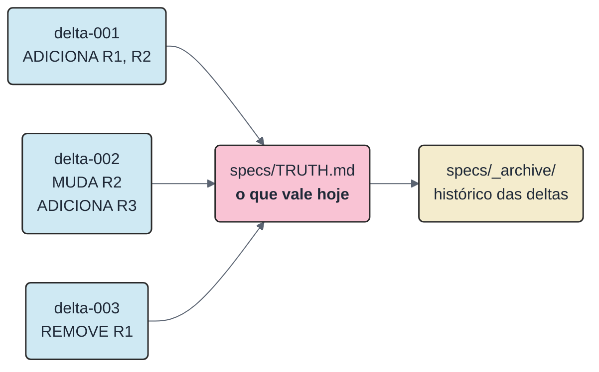
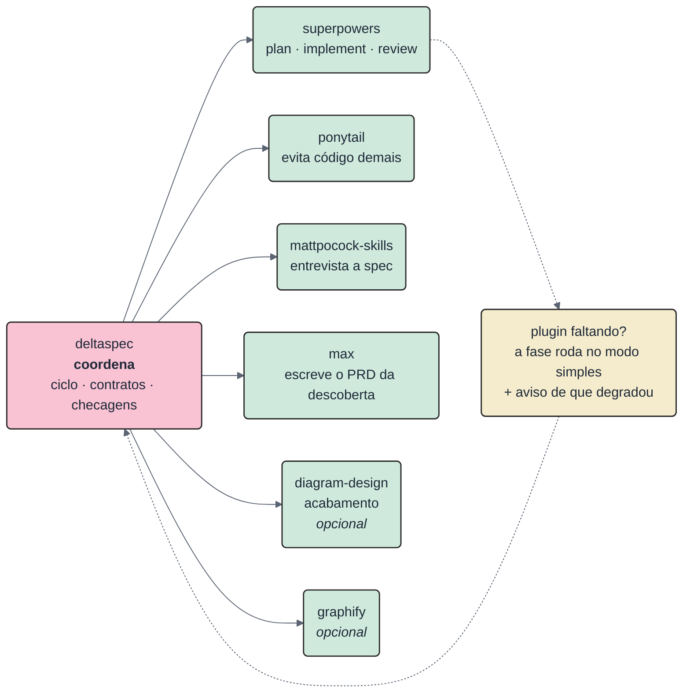
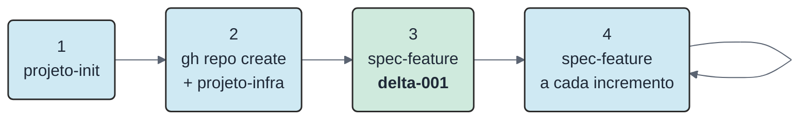
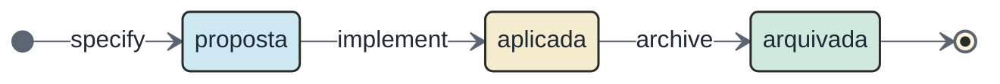
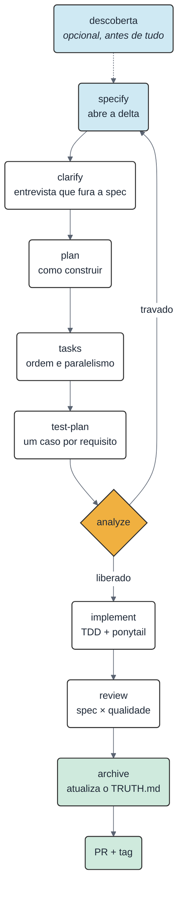
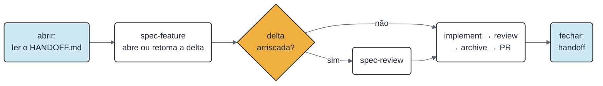
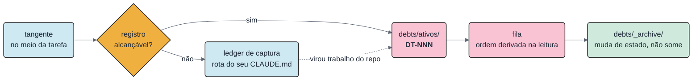

# deltaspec

**Spec-Driven Development por delta specs**, para o [Claude Code](https://claude.com/claude-code).

**[Read in English](README.en.md)**

Em vez de manter um documento de requisitos gigante que envelhece mal, cada feature escreve **só o que muda**. Um único arquivo — o `specs/TRUTH.md` — guarda o que vale hoje.

> **É o git, aplicado a requisitos.** Cada feature é um *commit* de spec (ADICIONA / MUDA / REMOVE). O `TRUTH.md` é o *working tree*: o estado atual, com todos os commits já aplicados. As specs antigas vão para `specs/_archive/` — elas são histórico, não verdade.

[Versão corrente: tags](https://github.com/iuripereira/deltaspec/tags) · 17 skills · Licença MIT

---

## Índice

1. [O problema](#1-o-problema)
2. [Instalação](#2-instalação)
3. [Comece um projeto](#3-comece-um-projeto)
4. [O ciclo de uma feature](#4-o-ciclo-de-uma-feature)
5. [O dia a dia](#5-o-dia-a-dia)
6. [O registro de débitos](#6-o-registro-de-débitos)
7. [As skills](#7-as-skills)
8. [As checagens automáticas](#8-as-checagens-automáticas)
9. [Onde cada coisa mora](#9-onde-cada-coisa-mora)

---

## 1. O problema

Você escreve um PRD de 40 páginas, implementa 3 features — e o PRD já mente. Ninguém reescreve o documento inteiro a cada mudança, então ele vira ficção.

A saída do deltaspec: **o documento grande nunca é escrito à mão.** Ele é montado a partir das deltas.



O que isso te dá:

| Você ganha | Como |
| --- | --- |
| Spec que não mente | O `TRUTH.md` só muda no arquivamento, e só com o que a delta declarou |
| Contexto barato para a IA | A IA lê só a partição relevante do TRUTH — curto por regra (`RNF1`) — em vez de um PRD inteiro |
| Rastreabilidade | Todo requisito tem ID fixo (`R7`, `RNF2`) e mostra de qual delta veio: `R7 (delta-006)` |
| Requisito não some sem querer | Um script compara o `TRUTH.md` antes e depois: sumiu sem `REMOVE` declarado, o PR trava |

---

## 2. Instalação

### 2.1 O plugin — 2 comandos dentro do Claude Code

```text
/plugin marketplace add iuripereira/deltaspec
/plugin install deltaspec@deltaspec
```

Pronto: as 17 skills aparecem com o prefixo `deltaspec:`. Para atualizar depois, `/plugin update deltaspec@deltaspec` — sem o `@deltaspec` do marketplace, o plugin não é encontrado.

### 2.2 Os motores — clone + 1 comando

O deltaspec **coordena**; plugins de terceiros **fazem** o trabalho pesado de cada fase. Clone o repositório e rode o instalador — assim você lê o script antes de executá-lo:

```bash
git clone https://github.com/iuripereira/deltaspec
bash deltaspec/scripts/instala-motores.sh
```

### 2.3 Os gates — 1 dependência

```bash
pip install pyyaml
```

Única dependência externa do framework, para validar o `doc-profile.yaml` ([ADR-0023](docs/adrs/ADR-0023-pyyaml-como-dependencia-admitida.md)). Sem ela os gates param com a mensagem pedindo este comando; o resto é biblioteca padrão do Python 3.11+.



Cada um cobre uma frente: [`superpowers`](https://github.com/anthropics/claude-plugins) executa plan, implement e review; `ponytail` segura o excesso de engenharia; `mattpocock-skills` entrevista a spec (`grilling`) e modela o domínio (`domain-modeling`); `max` escreve o PRD da descoberta (`write-prd`); o [`diagram-design`](https://github.com/cathrynlavery/diagram-design) é **opcional** e só entra quando o projeto o declara — o acabamento para cliente/gestão sai por motor nativo, sem plugin de terceiro no caminho padrão ([ADR-0029](docs/adrs/ADR-0029-apresentacao-como-modo-e-html-autocontido-canonico.md)); o `graphify`, também opcional, dá um grafo do código como fonte citável (`arquivo:linha`).

> **Regra de ouro:** plugin faltando **nunca quebra o ciclo**. A fase cai no caminho simples descrito em [`adapters.md`](skills/spec-feature/references/adapters.md) e você recebe um aviso dizendo qual fase perdeu potência.

### 2.4 Mermaid — o único CLI obrigatório

```bash
npm install -g @mermaid-js/mermaid-cli
```

Outros renderizadores (DBML, PlantUML, D2, Structurizr) e o exportador de PDF/DOCX só entram se o `doc-profile.yaml` do projeto pedir — a skill [`doc-entregavel`](skills/doc-entregavel/SKILL.md) lista os comandos na hora certa.

---

## 3. Comece um projeto



**1. Prepare a pasta.**

```text
/deltaspec:projeto-init
```

Ele descobre o tipo do projeto, escreve o `CLAUDE.md` a partir das regras canônicas, cria os arquivos-base e confere se os motores estão instalados. **Não sobrescreve nada:** se já existe um `CLAUDE.md`, você recebe um `CLAUDE.generated.md` ao lado, com o diff, e decide o que juntar.

**2. Proteja o repositório** (depois de criar o remote no GitHub):

```text
/deltaspec:projeto-infra
```

Branch protection, CI, checagem de Conventional Commits, release-please, review assistido. Rodar de novo não estraga nada — a segunda vez só relata o que já estava lá.

Ative também o gate pré-commit, uma vez por clone:

```bash
git config core.hooksPath .githooks
```

**3. Escreva a primeira feature.**

```text
/deltaspec:spec-feature
```

A **delta-001 é sempre o walking skeleton**: a menor fatia que funciona de ponta a ponta. Nunca "o sistema inteiro" — a visão grande vira a seção "Não implementado" do `TRUTH.md`.

**4. Repita a cada incremento.** O `TRUTH.md` cresce sozinho, um arquivamento por vez.

> **Projeto que já existe?** Nada é sobrescrito nem migrado sem você pedir. Os arquivos que faltam são criados, o `.gitignore` só recebe linhas novas, o `TRUTH.md` nasce vazio e cresce com as **novas** deltas, e a numeração continua do maior número já usado.

---

## 4. O ciclo de uma feature

Uma feature = uma pasta `specs/NNN-nome/` com `spec.md`, `plan.md` e `tasks.md`. Ela passa por três estados:



- **proposta** — a spec existe, o código não.
- **aplicada** — o código existe, mas o requisito ainda não entrou no `TRUTH.md`.
- **arquivada** — a pasta vai para `specs/_archive/NNN-nome/` **e** o `TRUTH.md` é atualizado.

> **Arquivar faz parte do "pronto".** Feature sem arquivamento é feature não terminada. A tag de versão sai no merge que fecha a delta.

O número `NNN` **nunca reinicia**: ele é citado em ADRs, commits e no próprio `TRUTH.md`.

### As fases



| Fase | A pergunta que ela responde | O que sai |
| --- | --- | --- |
| **descoberta** | "O que existe hoje, de verdade?" | dossiê do processo atual, com o nível de certeza de cada afirmação |
| **specify** | "O que muda no que já vale?" | `spec.md` com blocos ADICIONA/MUDA/REMOVE |
| **clarify** | "Onde essa spec é frágil?" | spec revisada depois da entrevista |
| **plan** | "Como construir?" | `plan.md` |
| **tasks** | "Em que ordem? O que dá para fazer em paralelo?" | `tasks.md` com dependências `(dep: T1, T2)` — e, se o `doc-profile.yaml` liga `motores.jira`, o `tickets.md` projetado para o Jira (épico + tickets + links de bloqueio) |
| **test-plan** | "Como eu provo que cada requisito funciona?" | `test-plan.md` com `cobre: Rn` |
| **analyze** | "Os documentos combinam entre si?" | `analyze.md` com veredito LIBERADO ou BLOQUEADO |
| **implement** | — | código + testes |
| **review** | "O código faz o que a spec prometeu? Sobrou gordura?" | achados dos dois eixos |
| **archive** | "O que passa a valer?" | `TRUTH.md` atualizado + delta movida |

### Nem toda feature precisa do ciclo inteiro

No specify a IA **sugere** um perfil, com uma linha de justificativa. Ele **só vale se você aprovar**, e a aprovação fica registrada no cabeçalho da spec.

| Etapa | `completo` | `enxuto` |
| --- | --- | --- |
| clarify | sempre | só se aparecer ambiguidade |
| test-plan | obrigatório | dispensável, com motivo escrito |
| review | dois eixos em paralelo | os dois eixos juntos, numa passada |
| plan · tasks · analyze · archive | inteiros | inteiros |

Correção de bug tem caminho próprio (`Tipo: bugfix`): template com sintoma, reprodução, causa-raiz e teste de regressão, e um pipeline curto — specify → plan → implement → review. Se o bug não muda requisito, arquiva **sem** mexer no `TRUTH.md`.

---

## 5. O dia a dia



Duas regras de higiene sustentam o resto:

- **1 sessão = 1 branch = 1 escopo.** Apareceu trabalho de outro assunto? Vira outra branch — ou um arquivo `DT-NNN` em `debts/ativos/`.
- **Feche com `/deltaspec:handoff`.** O que você descobriu vai para os arquivos do projeto, não para a memória da conversa.

---

## 6. O registro de débitos

O que você percebe no meio de uma tarefa não pode depender da sua memória. **Toda tangente vira um arquivo com ID estável** — e a ordem de atacar sai dos eixos que você atribuiu, não da opinião de quem está cansado no fim do dia.



| Natureza | O que é |
| --- | --- |
| `débito` | problema técnico a corrigir quando o gatilho disparar |
| `pendência` | trabalho ou decisão que sobrou de uma delta arquivada |
| `guarda` | aviso para **não** "consertar" histórico imutável — proteção, não trabalho |

Cada item ativo é um arquivo `debts/ativos/DEBT_DT-NNN-<topico>.md` com frontmatter (`id`, `natureza`, `estado`, `fila`, `descricao`) e, no corpo, o **Local** e o **Gatilho** de reavaliação. O item não é escrito à mão: `debito.py novo` calcula o `DT-NNN` e recusa o cadastro incompleto. Os três eixos da `fila` — quanto custa pagar, o atrito já observado e a chance de reincidir — ordenam a lista por um score calculado na leitura; o `DEBT.md` da raiz é projeção regenerável, nunca a fonte. Item resolvido **muda de estado e de pasta**: vai para `debts/_archive/`, e some da fila sem sumir do repositório. As regras completas vivem em `debts/README.md`.

```bash
# cadastra um item já validado — calcula o DT-NNN e recusa campo faltando
python3 skills/handoff/scripts/debito.py novo . --natureza débito \
  --descricao "sintoma observável" --fila P3·J3·Pr9 \
  --local "[artefato](caminho/da/raiz.py)" --gatilho "quando reavaliar"

# o que fazer primeiro — fila ordenada, com aviso de item esquecido
python3 skills/handoff/scripts/debito.py fila .

# regenera o índice por urgência do DEBT.md (projeção, ADR-0031)
python3 skills/handoff/scripts/debito.py indice .
```

**Fora de um projeto com registro alcançável, nada se perde.** A skill [`eu-tenho-tdah`](skills/eu-tenho-tdah/SKILL.md) captura a pendência num ledger cuja **rota** você declara no seu próprio `CLAUDE.md` — o framework nomeia rotas, jamais caminhos de máquina —, fecha com commit e sem push quando o destino é versionado, e migra o item para o `debts/` do repo dono assim que ele virar trabalho de verdade. É o par do [`handoff`](skills/handoff/SKILL.md), que faz o mesmo roteamento no fim da sessão.

> **Ticket é projeção, nunca a fonte** ([ADR-0021](docs/adrs/ADR-0021-projecao-de-tickets.md)). O item vive no repositório; o Jira ou o GitHub Issues recebe uma cópia derivada, e o `debito.py diff` acusa quando as duas divergem.

---

## 7. As skills

Dezesseis comandos do ciclo, na ordem em que você os encontra. Clique no nome para ler o detalhe da skill.

| Skill | Para que serve | Quando usar |
| --- | --- | --- |
| [`projeto-init`](skills/projeto-init/SKILL.md) | Transforma uma pasta qualquer num projeto que segue as convenções: `CLAUDE.md`, arquivos-base, `specs/` | Uma vez por repositório |
| [`projeto-infra`](skills/projeto-infra/SKILL.md) | Deixa a `main` protegida e o PR com checks verdes | Depois de criar o repo no GitHub. Precisa do `gh` autenticado |
| [`descoberta`](skills/descoberta/SKILL.md) | Vira material bruto (reunião, planilha, processo na cabeça de alguém) em dossiê onde toda afirmação diz sua fonte e seu nível de certeza | Não existe PRD validado, ou há material bruto para digerir |
| [`rodada-insumos`](skills/rodada-insumos/SKILL.md) | Concilia um insumo novo do cliente nos registros vivos: mineração, gate de decisões com o usuário, bump do PRD-proposta com entregável congelado, PR aberto | Chegou reunião/mensagem/planilha/resposta nova num projeto que já tem PRD-proposta |
| [`spec-feature`](skills/spec-feature/SKILL.md) | Conduz um incremento do specify ao PR, sem pular etapa. É o comando que você mais usa | A cada feature |
| [`spec-review`](skills/spec-review/SKILL.md) | Tenta furar a spec **antes** de virar código: premissas frágeis, erro não previsto, contrato externo | Opcional; recomendado quando a spec toca segurança, dados persistentes ou dependência nova |
| [`guarding-doc-integrity`](skills/guarding-doc-integrity/SKILL.md) | Impede que um valor repetido em 5 arquivos fique desencontrado: um assunto tem um arquivo dono, o resto linka | Um valor mudou num repositório com documentos canônicos |
| [`handoff`](skills/handoff/SKILL.md) | Fecha a sessão nos arquivos certos: um handoff por sessão em `.claude/handoffs/`, o índice `HANDOFF.md`, o registro `debts/` e o estado da delta em curso | Ao encerrar o dia — ou antes de limpar o contexto |
| [`ticket-to-jira`](skills/ticket-to-jira/SKILL.md) | Contrato de projeção repo → Jira: markdown nunca chega cru (sempre ADF via `md_para_adf.py`), templates de descrição por tipo, sincronia de mão única e idempotência | Projeção/povoamento de backlog no Jira — ou descrição chegando com `**` e crases literais |
| [`doc-entregavel`](skills/doc-entregavel/SKILL.md) | Congela um PDF/DOCX assinável para o cliente, com capa de assinatura e diagramas renderizados | Projeto com `publico.cliente: true` |
| [`gerar-diagrama`](skills/gerar-diagrama/SKILL.md) | Vira uma descrição em linguagem natural no fonte do diagrama: classifica a categoria e deriva a ferramenta da tabela normativa, em vez de deixar você escolher | Precisa de um diagrama e não quer errar a ferramenta |
| [`modelo-dados`](skills/modelo-dados/SKILL.md) | Mantém o modelo de dados em três camadas com dono único: `data-model.md` conceitual com ERD **derivado** do `.dbml`, e um gate que acusa entidade órfã e diagrama editado à mão | Projeto com `modelo-dados` obrigatório no `doc-profile.yaml` |
| [`status-pmo`](skills/status-pmo/SKILL.md) | Monta o site de status PMO (dashboard %/fase/farol, gantt com marcos, one-page por projeto) sempre da mesma forma | Portfólio/projeto que reporta status à gestão |
| [`audit-workspace`](skills/audit-workspace/SKILL.md) | Audita consistência entre repos de um workspace multi-repo: link cruzando fronteira, path absoluto hardcoded, gate documentado sem CI que o chame | Workspace passou por rename/split/merge |
| [`git-guard`](skills/git-guard/SKILL.md) | Mede a distância entre a convenção de git escrita e a que está de fato travada: segredo versionado, gate pré-commit configurado mas inerte, camada de agente ausente, commit acima do limiar | Auditar higiene de git de um repositório ou de um workspace inteiro |
| [`pedido-insumos`](skills/pedido-insumos/SKILL.md) | Gera um e-mail de cobrança por dono a partir do registro vivo de pendências, em vez de você recomeçar a lista a cada rodada | Insumo do cliente atrasando e a cobrança precisa sair nominal |

A décima sétima não é comando: [`eu-tenho-tdah`](skills/eu-tenho-tdah/SKILL.md) fica ligada o tempo todo e entrega dois eixos — molda a resposta (ação antes de contexto, listas ranqueadas, próximo passo concreto) e dá destino à tangente: toda pendência vira registro no sistema da [seção 6](#6-o-registro-de-débitos), nunca um convite no fim da resposta.

**spec-review ou analyze?** O analyze confere se os documentos **combinam entre si** (mecânico). O spec-review discute o **mérito** da spec.

---

## 8. As checagens automáticas

A ideia: **integridade não pode depender de quem está cansado.** Um humano esquece, uma IA otimista também. O script não.

Tudo roda **na sua máquina** — na fase analyze, no arquivamento e no pré-commit ([ADR-0001](docs/adrs/ADR-0001-gates-rodam-local.md)). Uma única dependência externa: `pip install pyyaml`, para validar o `doc-profile.yaml` ([ADR-0023](docs/adrs/ADR-0023-pyyaml-como-dependencia-admitida.md)); o resto é biblioteca padrão do Python 3.11+.

```bash
# o ciclo da delta: aceite, cobertura, estado, arquivamento sem perda,
# tamanho do TRUTH, dependências das tasks (checagens C1–C14)
python3 skills/spec-feature/scripts/check_cycle.py specs/NNN-nome

# os valores espelhados entre documentos e os links relativos
# (sem deps.toml na raiz — caso do repo derivado — troque o "." por "--links-only .")
python3 skills/guarding-doc-integrity/scripts/validate_integrity.py .

# a forma da entrada do CHANGELOG: categoria, tamanho, referência de PR, ordenação
python3 skills/spec-feature/scripts/check_changelog.py CHANGELOG.md
```

Achado ALTO ou CRÍTICO derruba o comando — e o implement não começa. A checagem mais importante é o **arquivamento sem perda**: requisito que sumiu do `TRUTH.md` sem um `REMOVE` declarado é CRÍTICO.

O `check_cycle.py` **avisa que é parcial**: ele diz quais checagens fez e lembra que "fugiu do escopo" e "violou regra canônica" continuam sendo julgamento humano. Automatizar isso daria falso "tudo certo" — a lista completa está na [skill](skills/spec-feature/SKILL.md).

Cada script carrega o próprio teste:

```bash
python3 skills/spec-feature/scripts/check_cycle.py --selftest
python3 skills/spec-feature/scripts/check_changelog.py --selftest
python3 skills/guarding-doc-integrity/scripts/validate_integrity.py --selftest
python3 skills/spec-feature/scripts/itens.py --selftest
python3 skills/spec-feature/scripts/tickets.py --selftest
python3 skills/handoff/scripts/debito.py --selftest
python3 skills/handoff/scripts/md_para_adf.py --selftest
python3 skills/handoff/scripts/projecao.py --selftest
python3 skills/audit-workspace/scripts/audit_workspace.py --selftest
python3 skills/git-guard/scripts/segredos.py --selftest
python3 skills/doc-entregavel/scripts/tabela_cliente.py --selftest
python3 skills/gerar-diagrama/scripts/gera_excalidraw.py --selftest
python3 skills/modelo-dados/scripts/check_data_model.py --selftest
python3 skills/doc-entregavel/scripts/exporta_entregavel.py --selftest  # exige pandoc + libs de exportação
python3 .github/scripts/versao_manifesto.py --selftest
python3 .claude/hooks/guarda-imutaveis.py --selftest
python3 .claude/hooks/guarda-confidencialidade.py --selftest
python3 .claude/hooks/guarda-sessao.py --selftest
```

O job `ci` roda todos eles — script novo sem entrada aqui e no workflow nasce sem rede.

---

## 9. Onde cada coisa mora

O princípio que não se negocia: **cada informação tem um dono.** Referencie, não copie.

| Arquivo | Dono de | Regra |
| --- | --- | --- |
| `specs/TRUTH.md` | o que **vale** hoje | Índice + partições em `specs/truth/` (um requisito = um heading — ADR-0034); só muda no arquivamento |
| `specs/_archive/` | histórico das deltas | Não se mexe |
| [`CHANGELOG.md`](CHANGELOG.md) | histórico permanente | Keep a Changelog, em PT-BR |
| `HANDOFF.md` | o **agora** (índice fino) | Detalhe de cada sessão em `.claude/handoffs/`; o arquivo da sessão nunca é podado |
| `debts/` | débito, pendência e lição | `DT-NNN` fixo, um arquivo por item; resolvido **muda de status, nunca some** — encerrado move para `debts/_archive/`; índice por urgência gerado em `DEBT.md`; regras em `debts/README.md` — visão geral na [seção 6](#6-o-registro-de-débitos) |
| [`docs/adrs/`](docs/adrs/) | decisões e o que foi descartado | Imutável depois de `Accepted`; mudou? nova ADR |
| [`CLAUDE.md`](CLAUDE.md) | as convenções do repositório | A IA lê a cada sessão |
| `deps.toml` | mapa dono → cópias autorizadas | Validado por script; vive só no repositório canônico, fora do payload público |

Na prática: **débito não vira comentário no HANDOFF, e decisão não vira parágrafo na spec.**

---

## Para saber mais

- [`CLAUDE.md`](CLAUDE.md) — as convenções deste repositório (release, git, clean code, testes, segurança).
- [`docs/adrs/`](docs/adrs/) — por que cada decisão foi tomada, e o que foi descartado no caminho.
- [`skills/spec-feature/references/cycle.md`](skills/spec-feature/references/cycle.md) — o ciclo em detalhe: entrada e saída de cada fase.
- [`CHANGELOG.md`](CHANGELOG.md) — o que mudou em cada versão.

> **O framework é aplicado a si mesmo.** Toda mudança em `skills/` passa pelo próprio ciclo — inclusive quando a mudança é no que o ciclo diz sobre si mesmo.
