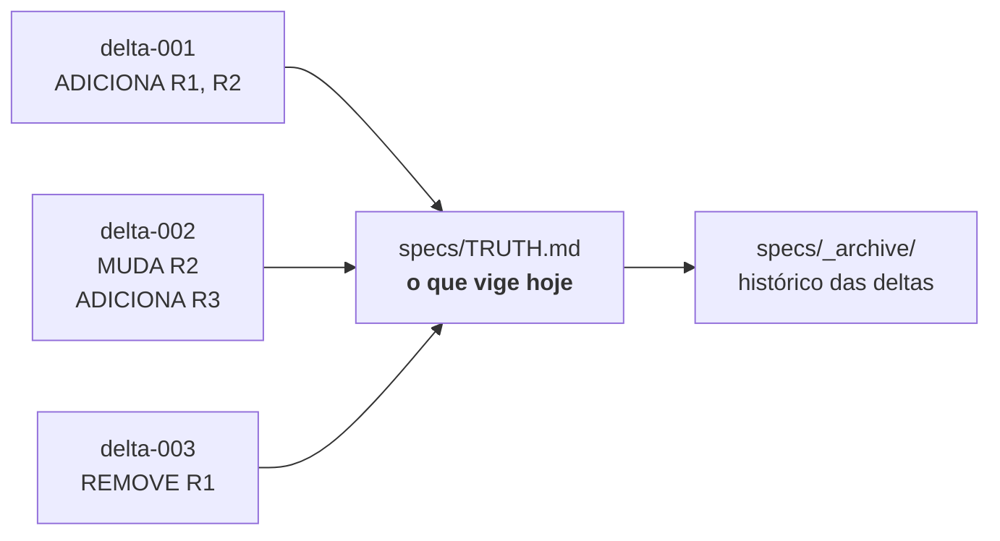
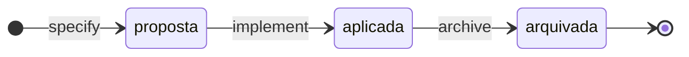
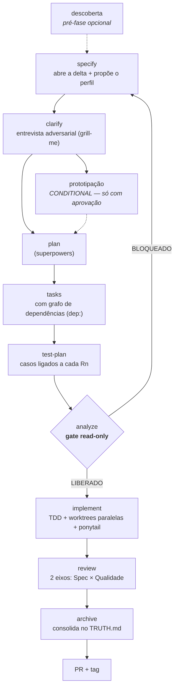
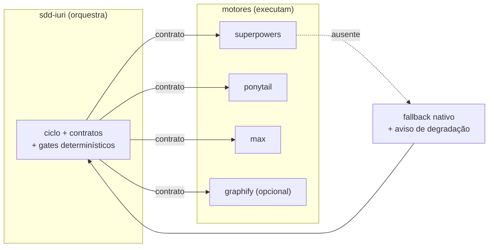
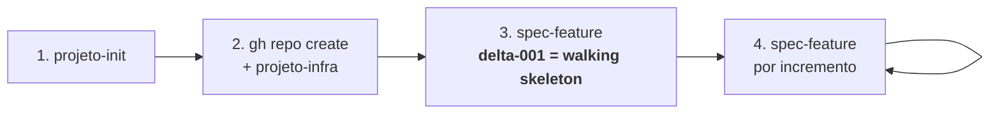
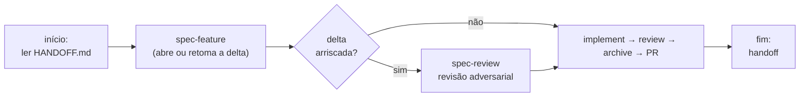

# sdd-iuri

Framework de **Spec-Driven Development por delta specs** para o [Claude Code](https://claude.com/claude-code).

**A ideia em uma frase:** em vez de manter um documento de requisitos gigante que apodrece, cada feature declara **só o que muda** — e um único arquivo, o `specs/TRUTH.md`, acumula o que vige hoje.

> **Analogia.** É o `git` aplicado a requisitos. Cada feature é um *commit* de spec (o delta: ADICIONA / MUDA / REMOVE). O `TRUTH.md` é o *working tree*: o estado atual, já com todos os commits aplicados. As deltas antigas ficam em `specs/_archive/` — são histórico, não verdade.

Divisão de responsabilidade entre os motores que o framework orquestra:
**grill-me previne construir a coisa errada · Superpowers previne construir sem disciplina · ponytail previne construir demais.**

Versão atual: `v0.13.0` · 9 skills · Licença MIT.

---

## Índice

1. [Por que delta spec](#1-por-que-delta-spec)
2. [Instalação e configuração](#2-instalação-e-configuração)
3. [Como funciona](#3-como-funciona)
4. [O fluxo sugerido](#4-o-fluxo-sugerido)
5. [As skills, uma a uma](#5-as-skills-uma-a-uma)
6. [Os gates determinísticos](#6-os-gates-determinísticos)
7. [Onde cada informação mora](#7-onde-cada-informação-mora)
8. [Convenções deste repositório](#8-convenções-deste-repositório)

---

## 1. Por que delta spec

O problema clássico do SDD tradicional: você escreve um PRD de 40 páginas, implementa 3 features, e o PRD já mente. Ninguém reescreve o documento inteiro a cada mudança — então ele vira ficção.

A resposta do sdd-iuri: **o documento grande nunca é escrito à mão.** Ele é *derivado*.



Consequências práticas:

| Você ganha | Como |
|---|---|
| Spec que não mente | O `TRUTH.md` só muda no archive, mecanicamente, a partir do que a delta declarou |
| Contexto barato para a IA | A IA lê o `TRUTH.md`, mantido abaixo do limiar de particionamento do [RNF1](specs/TRUTH.md) por gate, em vez de um PRD inteiro |
| Rastreabilidade | Todo requisito tem ID estável (`R7`, `RNF2`) e sufixo da delta que o criou (`R7 (delta-006)`) |
| Impossível "esquecer" um requisito | Um script compara o `TRUTH.md` antes/depois: requisito sumiu sem `REMOVE` declarado = **CRÍTICO**, PR bloqueado |

---

## 2. Instalação e configuração

### 2.1 O framework (2 comandos, dentro do Claude Code)

Não há cópia manual de arquivos. No REPL do Claude Code:

```
/plugin marketplace add iuripereira/sdd-iuri
/plugin install sdd-iuri@sdd-iuri
```

Pronto — as 9 skills ficam disponíveis sob o namespace `sdd-iuri:`. Para atualizar depois: `/plugin update sdd-iuri`.

### 2.2 Os motores de terceiros (1 comando, no terminal)

O framework **orquestra**; plugins de terceiros **executam** as fases pesadas. Um comando instala todos:

```bash
curl -fsSL https://raw.githubusercontent.com/iuripereira/sdd-iuri/main/scripts/instala-motores.sh | bash
```

(Com o repo clonado, chame [scripts/instala-motores.sh](scripts/instala-motores.sh) direto.)

| Motor | O que ele executa no ciclo | Sem ele |
|---|---|---|
| [`superpowers`](https://github.com/anthropics/claude-plugins) | plan · implement · review · worktrees paralelas | fase degrada com aviso |
| `ponytail` | anti-over-engineering, always-on | fase degrada com aviso |
| `max` | clarify (grill-me) · PRD da descoberta (write-prd) | fase degrada com aviso |
| `graphify` *(opcional, 4º motor)* | grafo de código como insumo citável (`arquivo:linha`) | fluxo grep/Explore segue normal |

> **Regra de ouro do framework (RNF2):** plugin ausente **nunca quebra o ciclo** — a fase cai no fallback nativo documentado em [`adapters.md`](skills/spec-feature/references/adapters.md) e você recebe um aviso explícito de qual fase degradou.

### 2.3 CLIs de diagrama (só o Mermaid é obrigatório)

Diagram-as-code renderizado por CLI. O `doc-profile.yaml` de cada projeto declara quais categorias valem — instale só o que ele pedir:

```bash
# Obrigatório — default do doc-profile; renderiza nativo no GitHub/Obsidian
npm install -g @mermaid-js/mermaid-cli          # mmdc

# Opcionais — só se o doc-profile do projeto declarar a categoria
npm install -g @softwaretechnik/dbml-renderer   # modelo de dados canônico (schema.dbml)
sudo apt install plantuml default-jre graphviz  # UML formal e casos de uso (.puml)
curl -fsSL https://d2lang.com/install.sh | sh -s --   # arquitetura visual moderna (.d2)
docker pull structurizr/cli                     # C4 formal via Structurizr DSL

# Só em projeto com publico.cliente: true (skill doc-entregavel — PDF/DOCX assinável)
pip install pypandoc-binary python-docx markdown   # + google-chrome para o PDF
```

**Camada de apresentação (opcional).** Projeto que declara a categoria `apresentacao` no `doc-profile.yaml` pode materializar um `.mmd` em FigJam via Figma MCP, para acabamento de stakeholder. O fluxo é **unidirecional**: o `.mmd` em git é a única fonte; edição feita no Figma nunca volta como fonte ([ADR-0015](docs/adrs/ADR-0015-figma-camada-apresentacao.md)).

### 2.4 Configuração por projeto

Um comando, uma vez por repositório:

```
/sdd-iuri:projeto-init
```

Ele detecta o tipo do projeto, gera o `CLAUDE.md` a partir das regras canônicas, cria o scaffold e confere se os motores estão instalados. **Nunca sobrescreve nada** — `CLAUDE.md` já existente vira `CLAUDE.generated.md` + diff, e você decide o merge.

Opcional, depois de criar o repo no GitHub:

```
/sdd-iuri:projeto-infra
```

Branch protection, CI, Conventional Commits, release-please, review assistido. Idempotente: 2ª rodada = no-op relatado.

Ative o gate pré-commit (uma vez por clone):

```bash
git config core.hooksPath .githooks
```

---

## 3. Como funciona

### 3.1 Os três estados de uma delta

Uma feature = uma delta spec em `specs/NNN-nome/`, com três arquivos (`spec.md`, `plan.md`, `tasks.md`) e três estados:



- **proposta** — a spec existe, o código não. Vive em `specs/NNN-nome/`.
- **aplicada** — o código existe, o requisito ainda não vige oficialmente.
- **arquivada** — move para `specs/_archive/NNN-nome/` **e** consolida no `TRUTH.md`.

> **O archive faz parte do "pronto".** Feature sem archive é feature não terminada — a tag de versão corta no merge que conclui a delta.

A numeração `NNN` é **global ao repositório e nunca reinicia**: é um ID estável, citado em ADRs, commits e no `TRUTH.md`.

### 3.2 O ciclo completo



O que cada fase entrega:

| Fase | Pergunta que ela responde | Saída |
|---|---|---|
| **descoberta** | "O que existe hoje, de verdade?" | dossiê as-is com claims rotulados |
| **specify** | "O que muda em relação ao que vige?" | `spec.md` com blocos ADICIONA/MUDA/REMOVE |
| **clarify** | "Onde essa spec é frágil?" | spec revisada após entrevista |
| **plan** | "Como construir?" | `plan.md` |
| **tasks** | "Em que ordem, e o que dá para paralelizar?" | `tasks.md` com arestas `(dep: T1, T2)` |
| **test-plan** | "Como eu provo que cada requisito funciona?" | `test-plan.md` com `cobre: Rn` |
| **analyze** | "Os artefatos são consistentes entre si?" | `analyze.md` com veredito LIBERADO/BLOQUEADO |
| **implement** | — | código + testes |
| **review** | "O diff faz o que a spec prometeu? Tem gordura?" | achados dos 2 eixos |
| **archive** | "O que passa a vigir?" | `TRUTH.md` atualizado + delta movida |

### 3.3 Perfil da delta: `completo` ou `enxuto`

Nem toda feature merece o pipeline inteiro. No specify, a IA **propõe** um perfil com justificativa de 1 linha; ele **só vale com sua aprovação explícita**, registrada no cabeçalho (`aprovado: AAAA-MM-DD`).

| Estágio | `completo` | `enxuto` |
|---|---|---|
| clarify | roda sempre | sob demanda (só com ambiguidade apontada) |
| test-plan | obrigatório | dispensável, com motivo declarado |
| review | 2 eixos em subagentes paralelos | eixos fundidos num subagente |
| plan · tasks · analyze · archive | integrais | integrais |

Spec sem o campo `Perfil` (deltas antigas) vale `completo` — retrocompatível, sem migração.

Há ainda o `Tipo: bugfix`: template próprio (sintoma, reprodução, causa-raiz, teste de regressão) e pipeline curto — specify → plan curto → implement → review. Bugfix sem mudança de requisito arquiva **sem** consolidar no `TRUTH.md`.

### 3.4 Framework orquestra, motores executam



Cada motor tem uma linha na tabela de contrato de [`adapters.md`](skills/spec-feature/references/adapters.md): versão testada, faixa aceita, data da última verificação, ponto sensível a breaking change e fallback correspondente.

---

## 4. O fluxo sugerido

### 4.1 Projeto novo (greenfield)



1. **`/sdd-iuri:projeto-init`** na pasta → tipo detectado (pasta vazia: ele pergunta), `CLAUDE.md` + scaffold.
2. Crie o repo (`gh repo create ... --source .`) e rode **`/sdd-iuri:projeto-infra`**. *Rulesets exigem repo público ou GitHub Pro.*
3. **`/sdd-iuri:spec-feature`** → a **delta-001 é sempre o walking skeleton**: a menor fatia vertical que funciona de ponta a ponta. Nunca "o sistema inteiro". Sua visão maior vira a seção "Não implementado" do `TRUTH.md`.
4. Repita por incremento. O `TRUTH.md` é a soma dos archives.

### 4.2 Projeto existente (brownfield)

Tudo é **idempotência defensiva** — nada é sobrescrito nem migrado sem pedido:

- `CLAUDE.md` existente → gera `CLAUDE.generated.md` + diff; você decide o merge.
- Scaffold: só cria o que falta. `.gitignore` recebe *append*. `docs/specs/` antigos ficam intactos.
- `TRUTH.md` nasce vazio e cresce com as **novas** deltas. Backfill do que já vige é tarefa assistida, sob demanda — não uma fase.
- `projeto-infra` consulta o que já existe e só preenche lacunas.
- A numeração `NNN` continua do maior existente.

### 4.3 O dia a dia (uma sessão de trabalho)



Duas regras de higiene que sustentam tudo:

- **1 sessão = 1 branch = 1 escopo.** Surgiu trabalho de outro escopo? Vira outra branch — ou uma linha `DT-NNN` no `DEBT.md`.
- **Feche a sessão com `/sdd-iuri:handoff`.** O que você descobriu vai para os registros com dono, não para a memória da conversa.

---

## 5. As skills, uma a uma

As 8 do ciclo, na ordem em que você as encontra:

### `/sdd-iuri:projeto-init` — o ponto de partida
**Objetivo:** transformar uma pasta qualquer num projeto que segue as convenções.
Detecta o tipo (`app-web` · `backend` · `site-estatico` · `workspace-dados` · `tooling`), monta o `CLAUDE.md` **copiando as regras canônicas** (não improvisando com conhecimento genérico do modelo), cria o scaffold (CHANGELOG, HANDOFF, DEBT, ADRs, `specs/` + `TRUTH.md` nos tipos com ciclo), oferece a infra e confere os plugins.
**Quando:** uma vez por repositório. **Nunca sobrescreve nada.**

### `/sdd-iuri:projeto-infra` — as travas do repositório
**Objetivo:** deixar a `main` protegida e o PR com checks verdes.
Branch protection via rulesets, CI, validação de Conventional Commits, release-please (changelog PT-BR), CodeRabbit/claude-code-action.
**Quando:** depois de criar o remote no GitHub, ou avulsa em repo existente. Idempotente.
**Requer:** `gh` autenticado + remote GitHub.

### `/sdd-iuri:descoberta` — antes de existir spec
**Objetivo:** impedir que presunção vire requisito.
Inventaria insumos brutos (transcrição de reunião, planilha legada, vídeo, processo na cabeça de funcionários), minera o processo as-is num dossiê onde **todo claim carrega confiança e fonte rastreável** — `confirmado` (evidência direta), `inferido` (dedução) ou `lacuna` (requer humano). Popula `GLOSSARY.md`/`DATA_DICTIONARY.md`, aponta divergências contra a baseline vigente e gera a pauta de validação com o stakeholder (ritual *Mob Elaboration*). O que sai daqui para o PRD vem marcado `[PRESUNÇÃO]`.
**Quando:** não há PRD validado, ou há material bruto para digerir.

### `/sdd-iuri:spec-feature` — o coração
**Objetivo:** conduzir um incremento do specify ao PR, sem pular etapa.
Cria `specs/NNN-nome/` com numeração global, abre a branch semântica, orquestra as fases delegando aos motores, roda os gates e, no archive, consolida o `TRUTH.md`.
**Quando:** a cada incremento de feature. É o comando que você mais usa.

### `/sdd-iuri:spec-review` — o advogado do diabo
**Objetivo:** achar o buraco na spec **antes** de virar código.
Revisão adversarial de spec + plan via `max:grill-me`: premissas frágeis, estados de erro esquecidos, contratos externos. Produz achados + edições propostas em blocos antes/depois — **nunca aplica nada sem sua aprovação**.
**Quando:** opcional, mas **recomendada** quando a spec toca segurança, dados persistentes, contrato externo ou dependência nova.
*Diferença para o analyze:* o analyze checa **consistência mecânica** entre artefatos; o spec-review checa **mérito**.

### `/sdd-iuri:guarding-doc-integrity` — o antídoto da duplicação
**Objetivo:** garantir que um valor de negócio duplicado em 5 arquivos não fique dessincronizado.
Um assunto tem **um arquivo dono**; valor concreto só existe no dono + espelhos sancionados; o resto do repo linka. O mapa dono→espelhos vive num `deps.toml` versionado, e um validador determinístico roda como hook pré-commit **e** gate de sessão.
**Quando:** o repo tem docs canônicos e um valor mudou. *Grep ad-hoc não é garantia; o script é.*

### `/sdd-iuri:handoff` — o fim de sessão
**Objetivo:** que nada importante viva só na conversa.
Atualiza o `HANDOFF.md` (diário de bordo, janela rolante), roteia débito/pendência/lição novo para o `DEBT.md` como `DT-NNN`, cita a delta em curso com fase e veredito do último gate, e imprime o prompt de retomada da próxima sessão.
**Quando:** ao encerrar. Argumento opcional: o foco da próxima sessão.

### `/sdd-iuri:doc-entregavel` — o documento que o cliente assina
**Objetivo:** congelar um entregável em PDF/DOCX assinável.
Renderiza os diagramas do `doc-profile.yaml`, monta o documento com capa de assinatura parametrizada e exporta versionado em `docs/entregaveis/`. Despacha por tipo: `prd-cliente`, `juridico-nda`, `juridico-contrato-ti`, `requisitos-cliente`.
**Quando:** projeto com `publico.cliente: true`, no `momento` declarado no perfil.
**Regra:** documento já enviado **nunca é sobrescrito** — nova baseline = novo arquivo = nova assinatura. Documento jurídico sai sempre como **minuta**, sujeita a revisão por advogado(a).

### `eu-tenho-tdah` — fora do ciclo
Não é comando: é o perfil de escrita pessoal do Iuri (baseado em [ayghri/i-have-adhd](https://github.com/ayghri/i-have-adhd)), always-on. Ação antes de contexto, listas sempre ranqueadas, tangente vira pendência salva em vez de sugestão solta no texto.

---

## 6. Os gates determinísticos

A regra por trás deles: **integridade não pode depender da diligência de uma sessão.** Um humano cansado (ou uma IA otimista) esquece; o script não.

Rodam **local** — na fase analyze, no archive e no pré-commit ([ADR-0001](docs/adrs/ADR-0001-gates-rodam-local.md)). Zero dependência externa: só stdlib do Python 3.11+.

### `check_cycle.py` — a metade mecânica do analyze

```bash
python3 skills/spec-feature/scripts/check_cycle.py specs/NNN-nome
```

| Check | O que verifica | Falha grave? |
|---|---|---|
| C1 | Critérios de aceite presentes | ALTO |
| C2 | Cobertura spec ↔ tasks (todo Rn tem task; toda task cita Rn) | ALTO |
| C3 | Estado declarado × localização real do diretório | ALTO |
| C4 | **Archive sem perda** — requisito sumiu do TRUTH sem `REMOVE` declarado | **CRÍTICO** |
| C5 | Tamanho do `TRUTH.md` contra o limiar de particionamento do [RNF1](specs/TRUTH.md) | — |
| C6 | Pendência de risco roteada para o `DEBT.md` | ALTO |
| C7 | Medição do split de PR (artefatos grandes = PR próprio) | BAIXO |
| C8 | Cobertura do plano de testes (todo Rn tem caso) | ALTO |
| C9 | Grafo de tasks válido — `dep:` existente e sem ciclo | ALTO |
| C10 | Archive sem task `- [ ]` aberta | ALTO |

Saída com **ALTO** ou **CRÍTICO** → exit 1 → o implement não começa.

> O script **se declara parcial**: ele nomeia os checks que cobriu e avisa que os checks 3 e 5 do `analyze.md` (scope creep, violação de regra canônica) são **juízo humano** e não rodaram. Automatizá-los produziria falso negativo confiante — renúncia registrada por design.

### `validate_integrity.py` — os espelhos

```bash
python3 skills/guarding-doc-integrity/scripts/validate_integrity.py .
```

C1 espelhos em sincronia · C2 materialização fora dos arquivos sancionados · C3 links relativos vivos.

### Autoteste

Todo script de gate carrega o próprio teste, com fixtures, validado no CI (RNF4):

```bash
python3 skills/spec-feature/scripts/check_cycle.py --selftest
python3 skills/guarding-doc-integrity/scripts/validate_integrity.py --selftest
```

---

## 7. Onde cada informação mora

O princípio inegociável: **fonte canônica única.** Cada informação tem **um** dono. Referencie, não duplique.

| Arquivo | Dono de | Regra |
|---|---|---|
| [`specs/TRUTH.md`](specs/TRUTH.md) | o que **vige** hoje | Só muda no archive, mecanicamente |
| `specs/_archive/` | histórico das deltas | Imutável |
| [`CHANGELOG.md`](CHANGELOG.md) | histórico permanente | Keep a Changelog 1.0.0, em PT-BR |
| [`HANDOFF.md`](HANDOFF.md) | o **agora** | Janela rolante — entrada antiga sai |
| [`DEBT.md`](DEBT.md) | débito, pendências e lições | `DT-NNN` estável; item quitado **muda de status, nunca some** |
| [`docs/adrs/`](docs/adrs/) | decisões com renúncia | Imutável após `Accepted`; mudou? nova ADR com `Supersedes` |
| [`CLAUDE.md`](CLAUDE.md) | as convenções | Lido pela IA a cada sessão |
| `deps.toml` | mapa dono → espelhos | Validado por script |

Regra prática: **débito não vira comentário no HANDOFF, e decisão não vira parágrafo na spec.** Cada coisa no dono.

---

## 8. Convenções deste repositório

**Tríade de release:** SemVer 2.0.0 (a **tag git é a fonte da versão** — este repo não tem `package.json`) · Keep a Changelog 1.0.0 em PT-BR · Conventional Commits 1.0.0 com escopo = nome da skill ou da delta. Correlação: `fix` = PATCH · `feat` = MINOR · `!` = MAJOR; o maior vence. **A tag corta no merge que conclui a delta** — normalmente o PR de archive.

**Git:** `main` protegida por ruleset, merge só via PR com `ci` + `commits` verdes. Branch por escopo, merge por squash, e PR acima do limiar canônico de tamanho é anti-padrão (valor em [`canonical-rules.md`](skills/projeto-init/references/canonical-rules.md), medido pelo C7).

**CI:** valida JSON/TOML/YAML, o frontmatter das `SKILL.md`, o inventário de skills contra os manifestos, os `--selftest` dos gates, a portabilidade dos caminhos (RNF5 — nada de caminho absoluto de máquina; use `${CLAUDE_PLUGIN_ROOT}`) e a integridade documental via `deps.toml`.

**O framework é aplicado a si mesmo.** Toda mudança em `skills/` passa pelo ciclo — inclusive quando a mudança é no que o ciclo diz sobre si mesmo. As skills vivem em `skills/<nome>/`, o manifesto em `.claude-plugin/plugin.json`.
